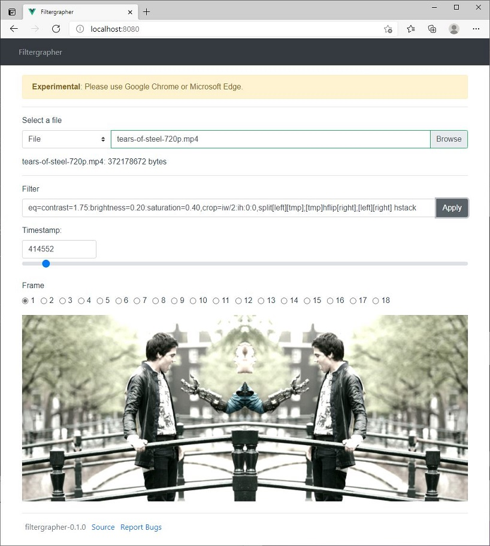

# `Filtergrapher`
FFmpeg filtergraph editor in the browser. Powered by `libavfilter`, Vue and Web Assembly!

https://alfg.github.io/filtergrapher/



⚠️ Experimental: Bugs and breaking changes are be expected.

Please use Google Chrome or Microsoft Edge due to limited support for [SharedArrayBuffer](https://caniuse.com/sharedarraybuffer) and the [required CORS headers](https://developer.mozilla.org/en-US/docs/Web/JavaScript/Reference/Global_Objects/SharedArrayBuffer) for Firefox on Github Pages.

## Development
`filtergrapher` uses [emscripten](https://emscripten.org/) to compile [FFmpeg](https://ffmpeg.org)'s [libav](https://ffmpeg.org/doxygen/4.1/index.html) to [Web Assembly](https://webassembly.org/) via [Docker](https://www.docker.com/).

Emscripten is also used to create and compile the Wasm bindings to be imported by the browser.

### Requirements
* `nodejs` - https://nodejs.org/en/download/
* `docker` - https://docs.docker.com/desktop/

### Setup 
* Clone project and build the Wasm module via Docker:
```
docker-compose run filtergrapher make
```

This will build the Wasm module and place it into the `/dist` directory.

* Copy the JS and Wasm modules into `www/public/`:
```
cp -a dist/. www/public/
```

* Install and run the web application:
```
cd www
npm install
npm run serve
```

* Load `http://localhost:8080/` in the web browser.

### Compiles and minifies for production
```
npm run build
```

### Deploy
Deploys to [Github Pages](https://pages.github.com/)
```
npm run deploy
```

View at: https://alfg.github.io/filtergrapher/

### Resources
* https://ffmpeg.org/doxygen/4.1/index.html
* https://ffmpeg.org/doxygen/4.1/filtering_video_8c-example.html
* https://emscripten.org/
* https://vuejs.org
* https://bootstrap-vue.org

## License
MIT